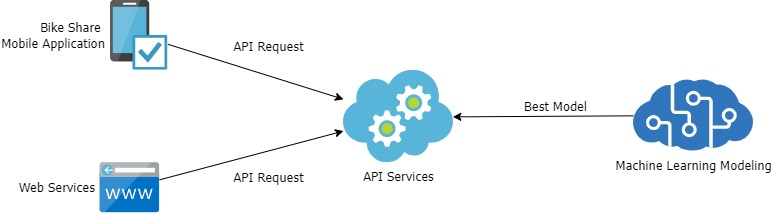
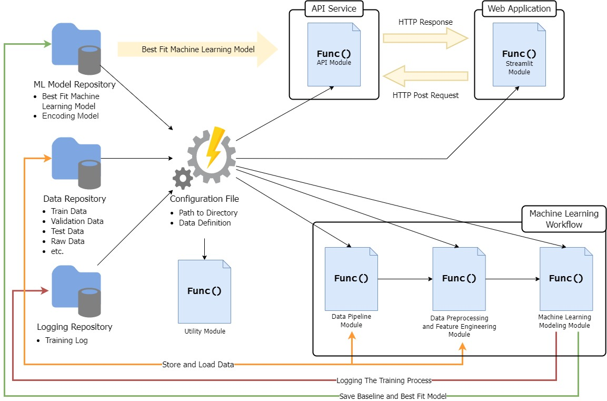
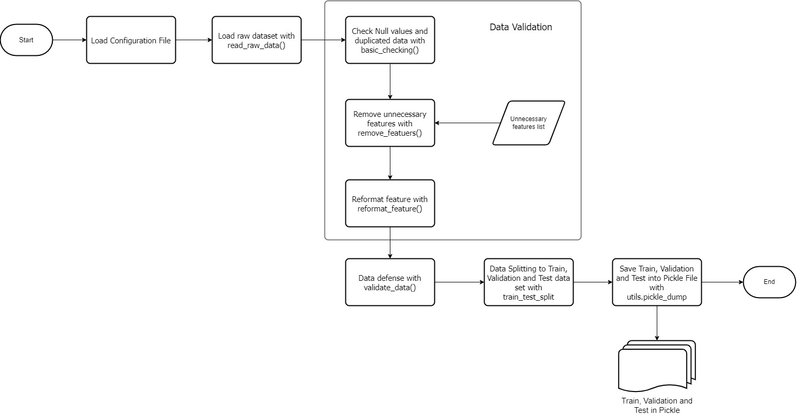
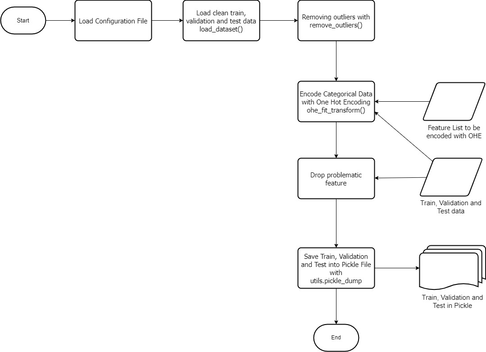
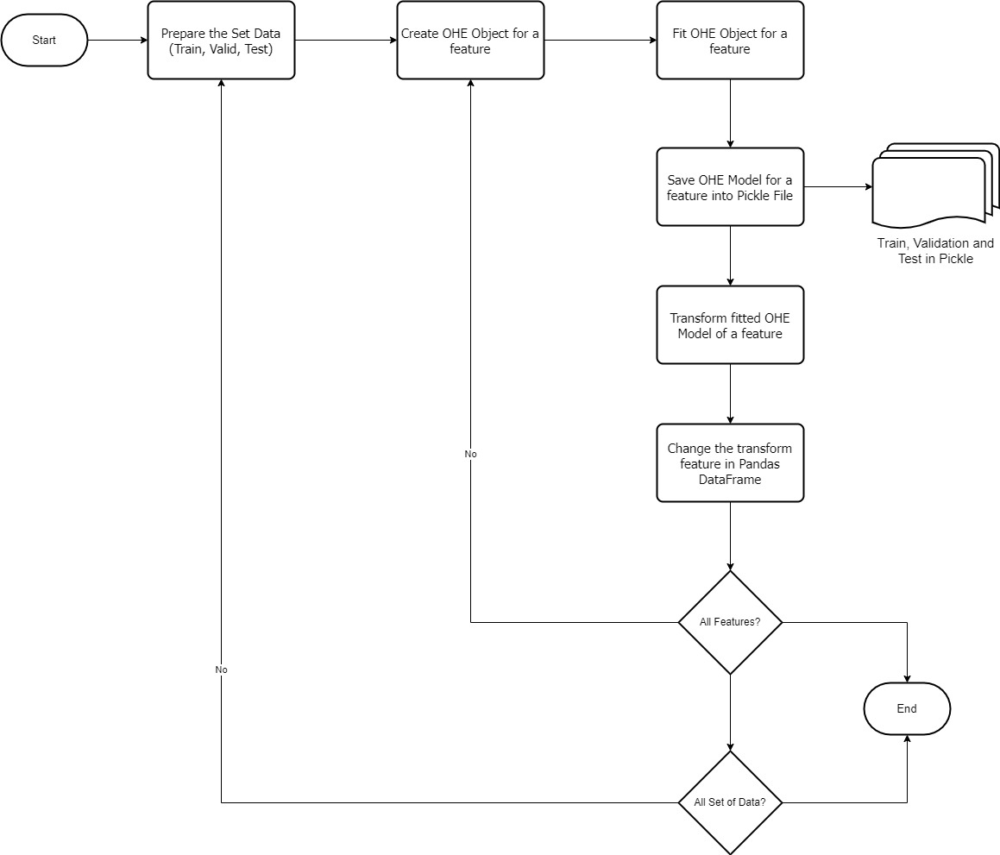
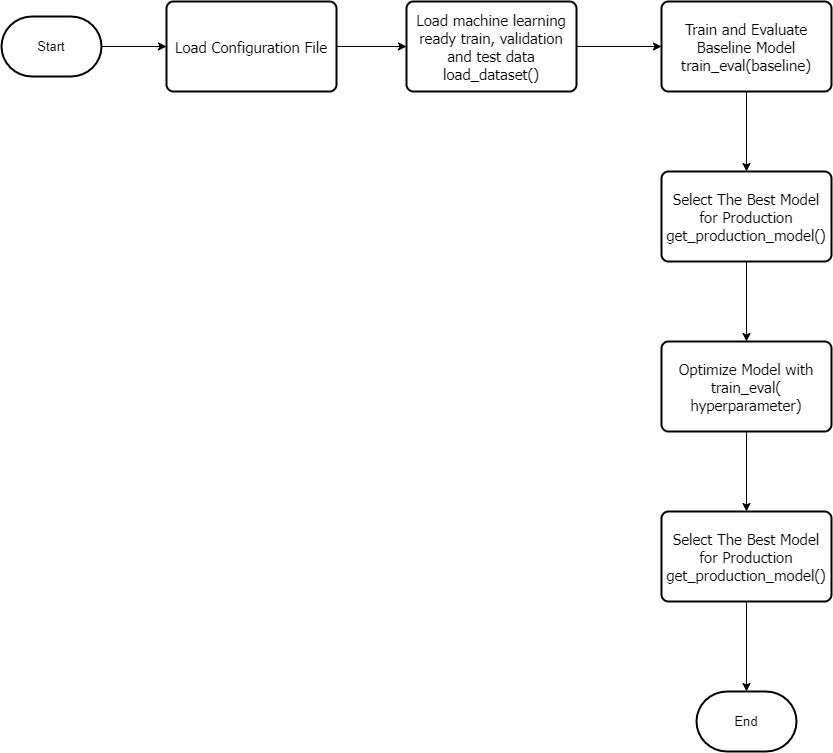
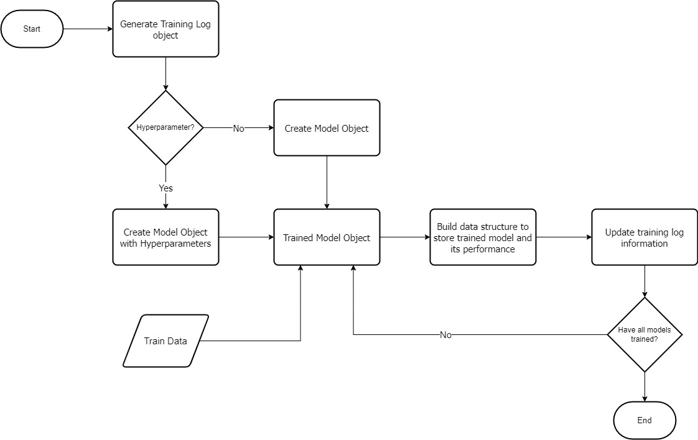
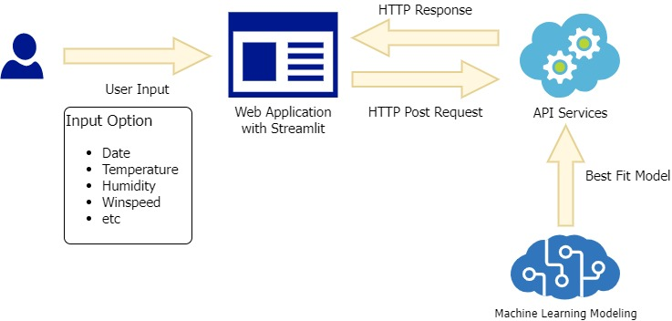
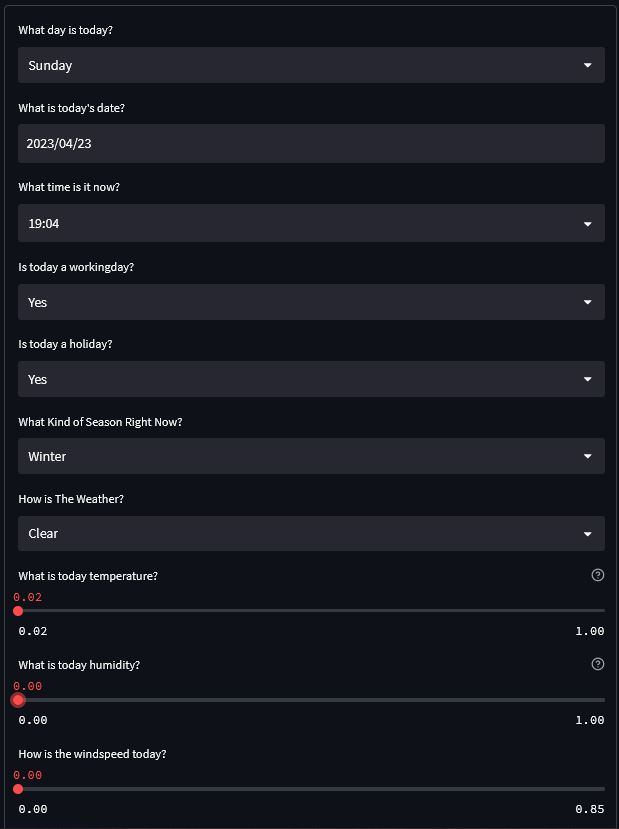
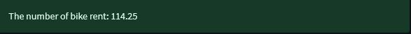

# Machine Learning Service to Predict Bike Share Demand
## Introduction
What should we do after we've completed the rigorous and cumbersome process of traning and optimizing our Machine Learning model to find the best fit ML model? The answer is to publish our best fit model so it can be used as per our objective of modeling in the first place.
In this project, I've obtained the best fit machine learning to predict the demand of bike for bike-sharing businesses. Then, I've put the best fit model as an API service that can be used for other services. Here, is my illustration about the usage of this api:

To demonstrate the usage of the API, I've built a simple HTML form that would send an API request to the API service and return a prediction.
## Project Description
### Background
This project is conducted to help bike-share businesses to optimize their bike supply and allocation by predicting the demand of bike rent. based factors such as:
1. Environment Condition (Weather, Season, Temperature, etc.)
2. Kind of days (Holiday, Weekday, Workday, etc.)

### Datasets
The dataset that is used for this project is coming from [UCI Machine Learning](https://archive.ics.uci.edu/ml/datasets/Bike+Sharing+Dataset). The dataset has been used by Fanaee-T, Hadi, and Gama, Joao to conducted a [machine learning research](#references).
There are 721 data points and 17 features. However, we won't use all of the featues because some featues are not useful to the prediction. Here are the feature we use:
- dteday : date (*Integer*)
- season : season (*Integer*)
Data Values: {1: winter, 2: spring, 3: summer, 4: fall}
- yr : year (*Integer*)
Data Values {0: 2011, 1:2012}
- mnth : month (*Integer*)
Data Values: {1 to 12}
- hr : hour (*Integer*) 
Data Values: {0 to 23}
- holiday: weather day is holiday or not (*Integer*)
Data Values: {0: Not a Holiday 1: Holiday}
- weekday: day of the week (*Integer*) 
Data Values: {0: Sunday, 1: Monday, 2: Tuesday, 3: Wednesday, 4: Thursday, 5: Friday, 6: Saturday}
- workingday : if day is neither weekend nor holiday is 1, otherwise is 0. (*Integer*)
- weathersit : weather situation (*Integer*) 
Data Values {1: Clear, 2:Mist, 3:Light Snow, 4-Heavy Rain}
- temp : Normalized temperature in Celsius (*floating point*)
- hum: Normalized humidity (*floating point*)
- windspeed: Normalized wind speed (*floating point*)
- cnt: count of total rental bikes including both casual and registered (target) (*Integer*)

## Project Arcitecture

There are several modules in this projects:
1. Machine Learning Workflow Module
2. API Module
3. Application Module

Each of this module are interconnected, logically, through the configuration file. This file is used to store common data that is often used by the other modules used such as the file directory and path, dataest range, etc.

## Machine Learning Workflow
### Data Pipeline
In this process we've done the following steps:
- Data Collection
- Data Definition
- Data Validation
- Data Defense
- Data Splitting

Data Collection and Definition process have been explained based on the dataset we've gathered. For the rest of the steps can be seen in this following diagram:

### Exploratory Data Analysis (EDA)
This is where we explore the dataset and gain a glimpse of our data look like. [Here is the result of EDA](notebooks/eda.ipynb)

### Data Preprocessing and Feature Engineering
In this process, the data is manipulated based on the finding in EDA and also is transformed into machine learning friendly data. Here is the processed of Data Preprocessing and Feature Engineering:

Here is more detail process of how the transform with OHE:

### Modeling
After all data is preprocessed and manipulate with feature engineering. The machine learning data is ready to train and test. Here is the diagram explaining the process of the data modeling:

For mode detail process of training and evaluation can be seen in the following diagram:

## Building the Machine Learning Service
The Machine Learining service would be deployed as API and demonstrated through a web application. The API for the service is built using FastAPI whilst the web application is built thorugh Streamlit. Here is the illustration of how user can use the Machine Learning Service through web application:

### Streamlit
Streamlit will provide easy web interface for user to input necessary data in the form of HTML forms. Here is the streamlit forms:

The user input from streamlit are expected to be datetime, string or floating point. The input data from user has been limited based on the data range of the actual dataset hance, user can't provide random input to the system.

However, the data, as we can see in the [dataset description](#datasets), doesn't have a string and datetime data, hence, transformation of the input data type is necessary:
1. For Datetime data type, we could extract the date, year, month and hour from the Datetime attributes
2. For the string data (which covers the categorical data) would be mapped based on its actual values through a function within the [streamlit_func.py](src/streamlit_func.py) file.

Furthermore, once user click the `predict` button the data would be sent to the FastAPI server.

### FastAPI
FastAPI will receive the request from Streamlit and then get the best fit Machine Learning model and predict the input from streamlit and return the result to the streamlit to be shown.

## How to Use
1. Install Docker for Windows
2. Clone the Repository
3. Run this command `docker compose up`
4. Open Browser type localhost:8501
5. Input The Desired Data, refer to the [Streamlit section](#streamlit)
6. Expeced Output

If you don't have docker on your laptop follow this steps
1. Clone the repository
2. Install the requirement with `python -m pip install requirements.txt`
3. From the cloned repository, run this command 'streamlit run src/streamlit_code.py'
4. From the cloned repository, run this command 'python src/api.py'
5. Open Browser type localhost:8501
6. Input The Desired Data, refer to the [Streamlit section](#streamlit)
7. Expeced Output

## References
Fanaee-T, Hadi, and Gama, Joao, 'Event labeling combining ensemble detectors and background knowledge', Progress in Artificial Intelligence (2013): pp. 1-15, Springer Berlin Heidelberg